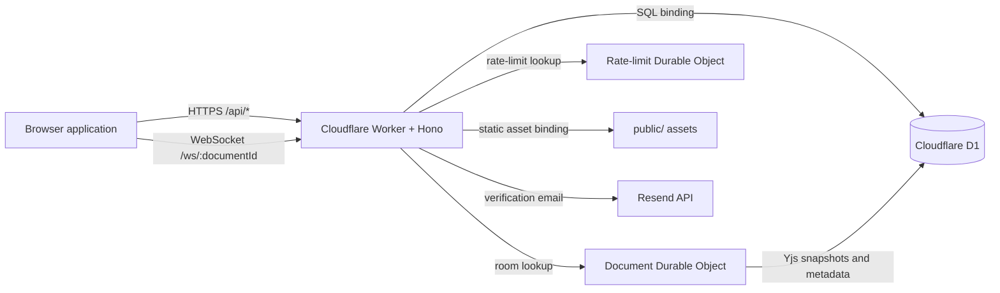
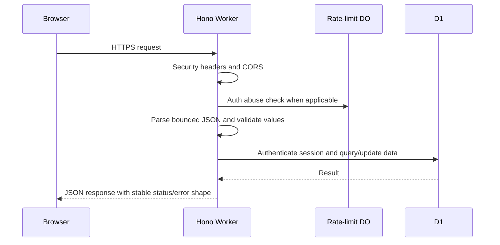
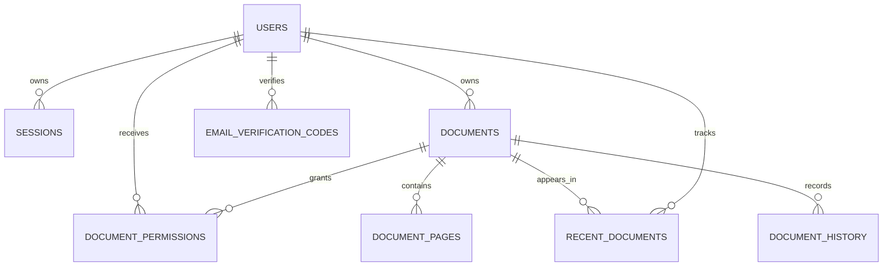
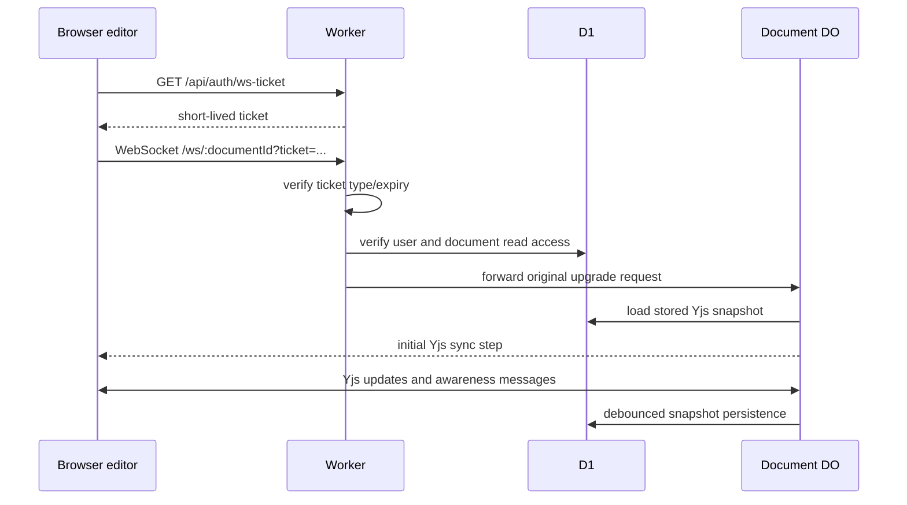

# SyncroEdit Architecture

This document is the technical source of truth for SyncroEdit. It describes the deployed
Cloudflare system, browser application, authentication model, collaboration protocol, data model,
security boundaries, failure handling, and the ownership rules used when extending the project.
The companion [PROJECT_STRUCTURE.md](PROJECT_STRUCTURE.md) explains how repository files depend on
one another. [FILE_REFERENCE.md](FILE_REFERENCE.md) maps those responsibilities to every retained
first-party file and groups the upstream-maintained vendor assets.

## 1. System Context



The Worker is the only backend entrypoint. Browser code never connects directly to D1, Durable
Object storage, or Resend. All permissions are checked at the Worker boundary before a request is
forwarded to a document room.

## 2. Repository Ownership

| Area                              | Responsibility                                                                     |
| --------------------------------- | ---------------------------------------------------------------------------------- |
| `src-worker/index.js`             | Deployment entrypoint and Durable Object export contract.                          |
| `src-worker/app.js`               | Hono construction, global middleware, error mapping, shared route dependencies.    |
| `src-worker/routes/`              | HTTP route registration grouped into auth, user, documents, and realtime domains.  |
| `src-worker/auth.js`              | Password hashing, JWT/session authentication, verified-user guards.                |
| `src-worker/security.js`          | Request limits, validation, CORS, headers, binding checks, document authorization. |
| `src-worker/emailVerification.js` | Code generation/hashing and Resend delivery.                                       |
| `src-worker/syncObject.js`        | One Yjs collaboration room per document.                                           |
| `src-worker/rateLimitObject.js`   | Durable authentication-abuse counters.                                             |
| `public/js/core/`                 | Runtime configuration and the low-level HTTP/WebSocket API client.                 |
| `public/js/app/`                  | Application composition, navigation, lifecycle, and API façade.                    |
| `public/js/features/`             | Auth, editor, library, profile, theme, and UI feature ownership.                   |
| `public/css/app/`                 | Ordered core, editor, effects, and settings styles.                                |
| `public/css/pages/`               | Styles that belong to one authentication page.                                     |
| `migrations/`                     | Append-only D1 schema history. Existing migrations are never rewritten.            |
| `tests/`                          | Worker, security, frontend, and browser contract coverage.                         |

`public/js/main.js` is the single browser entrypoint. `body[data-page]` selects a page initializer,
so static HTML pages do not contain application logic.

## 3. Cloudflare Runtime

Wrangler serves `public/` through the `ASSETS` binding and runs the Worker first for `/api/*` and
`/ws/*`. The deployed bindings are:

| Binding                | Type                     | Purpose                                                                        |
| ---------------------- | ------------------------ | ------------------------------------------------------------------------------ |
| `DB`                   | D1                       | Users, sessions, documents, permissions, recents, history, verification codes. |
| `DOCUMENT_SYNC_OBJECT` | Durable Object namespace | Maps a document UUID to its collaboration room.                                |
| `RATE_LIMIT_OBJECT`    | Durable Object namespace | Maps an IP/action key to a durable counter.                                    |
| `ASSETS`               | Static assets            | Serves HTML, CSS, modules, fonts, and vendored browser libraries.              |

Production secrets are `JWT_SECRET`, `RESEND_API_KEY`, and `EMAIL_CODE_PEPPER`. They are configured
with Wrangler and must never appear in source or `wrangler.toml`. `EMAIL_FROM`, `APP_NAME`, and
`APP_URL` are non-secret variables.

The historical class names `SynchroDocumentObject` and `SynchroRateLimitObject` are part of
Cloudflare's Durable Object migration contract. Do not rename them or rewrite their migration tags.

## 4. Request Pipeline



Global middleware applies security headers, tight CORS on API routes, structured error conversion,
and request-size limits. Authentication routes additionally pass through the durable rate limiter.
Route modules receive dependencies explicitly; they do not store request data in module globals.

### Public HTTP contracts

| Method   | Path                            | Authentication        | Purpose                                                    |
| -------- | ------------------------------- | --------------------- | ---------------------------------------------------------- |
| `GET`    | `/health`                       | None                  | Runtime health and timestamp.                              |
| `GET`    | `/api/config`                   | None                  | Browser-safe feature/runtime configuration.                |
| `POST`   | `/api/auth/signup`              | None                  | Create an unverified account and verification code.        |
| `POST`   | `/api/auth/login`               | None                  | Validate credentials and create a session.                 |
| `POST`   | `/api/auth/check-username`      | None                  | Check username availability.                               |
| `POST`   | `/api/auth/logout`              | Refresh cookie        | Delete the current session and cookie.                     |
| `POST`   | `/api/auth/refresh-token`       | Refresh cookie        | Rotate the short-lived access token.                       |
| `POST`   | `/api/auth/send-verification`   | Optional bearer token | Send a purpose-bound verification code.                    |
| `POST`   | `/api/auth/resend-code`         | Optional bearer token | Replace/refresh an active code.                            |
| `POST`   | `/api/auth/verify-email`        | Optional bearer token | Consume a valid code and mark the email verified.          |
| `GET`    | `/api/auth/ws-ticket`           | Verified bearer token | Issue a 30-second WebSocket ticket.                        |
| `GET`    | `/api/user/profile`             | Bearer token          | Read the current profile and verification state.           |
| `PUT`    | `/api/user/profile`             | Verified bearer token | Update allowed profile fields.                             |
| `PUT`    | `/api/user/password`            | Verified bearer token | Replace the password after current-password validation.    |
| `GET`    | `/api/user/sessions`            | Verified bearer token | List active sessions.                                      |
| `DELETE` | `/api/user/sessions/:sessionId` | Verified bearer token | Revoke one owned session.                                  |
| `DELETE` | `/api/user/sessions`            | Verified bearer token | Revoke every other session.                                |
| `GET`    | `/api/documents`                | Verified bearer token | List owned/shared/recent public documents with pagination. |
| `POST`   | `/api/documents`                | Verified bearer token | Create a document and initial page.                        |
| `PATCH`  | `/api/documents/:id`            | Editor access         | Update title or first-page compatibility content.          |
| `POST`   | `/api/documents/:id/recent`     | Read access           | Upsert a recent-document record.                           |
| `GET`    | `/api/documents/:id/settings`   | Read access           | Read visibility/ownership state.                           |
| `PATCH`  | `/api/documents/:id/settings`   | Owner                 | Update public visibility.                                  |
| `DELETE` | `/api/documents/:id`            | Owner/editor          | Delete as owner or remove own collaboration access.        |
| `POST`   | `/api/documents/:id/transfer`   | Owner                 | Transfer ownership and retain editor access.               |
| `GET`    | `/api/documents/:id/history`    | Read access           | Return the latest 50 audit events.                         |
| `GET`    | `/api/documents/:id/info`       | Read access           | Return lightweight document metadata.                      |

Access tokens are bearer JWTs held in memory by the browser. Refresh tokens are JWTs stored in an
HttpOnly cookie and mirrored by a D1 session row. Logging out or revoking a session invalidates the
server-side row, so a structurally valid refresh token alone is insufficient.

## 5. Email Verification

Verification codes are generated with Web Crypto, hashed with `EMAIL_CODE_PEPPER`, and stored only
as hashes. Rows are purpose-bound, expire, track failed attempts, and are consumed on success. The
application maintains `email_verified_at` as the source of truth while repairing the legacy
`isEmailVerified` mirror for compatibility.

Email delivery failures are logged with route/purpose context without logging the raw code or secret.
Production responses avoid exposing whether an address exists beyond the established API contract.

## 6. Document Authorization and Data Model



`getDocumentAccess()` centralizes read/edit/owner decisions. Routes must call the matching
`assertDocumentReadable`, `assertDocumentEditable`, or `assertDocumentOwner` guard before accessing
protected data. Public documents are readable only through the existing recent/access behavior;
public visibility is not an unrestricted write grant.

The `documents.yjsState` value is the collaborative source snapshot. `document_pages` remains for
the existing first-page/API compatibility contract. `document_history` is an audit summary rather
than a complete document-version store.

## 7. Realtime Collaboration



One Durable Object instance owns one document room. It maintains the in-memory Y.Doc, connected
WebSockets, awareness metadata, and a debounced save timer. Read-only participants may receive sync
and awareness data but cannot persist editing updates. Unsupported message types are closed rather
than parsed permissively. The Worker repeats permission checks before forwarding an upgrade, and the
Durable Object validates the ticket context again.

## 8. Browser Architecture

The browser boot flow is:

1. HTML loads runtime config, import maps, CSS, and `/js/main.js`.
2. The entrypoint selects the initializer from `data-page`.
3. Auth pages initialize only their form/controller and visual bot modules.
4. The editor bootstrap creates `App`, which owns profile, theme, library, UI, and editor lifecycles.
5. A verified user either sees the document library or opens the document from `?doc=<uuid>`.
6. `Editor` restores a local IndexedDB Yjs snapshot, requests a WebSocket ticket, synchronizes with
   the Durable Object, mounts visible Quill pages, and reports lifecycle/status events to `App`.

The editor uses Yjs updates as canonical content. Quill HTML is untrusted at paste/import/render
boundaries and must pass through `quillSanitizer.js`. Page, selection, image, navigation, border,
readability, cursor, search, and toolbar responsibilities live in dedicated managers.

## 9. Offline and Service Worker Behavior

`public/sw.js` precaches the reachable application shell. Navigation requests are network-first so
HTML can update promptly; static assets are cache-first and populate the cache after a successful
network response. API, WebSocket, non-GET, and non-HTTP requests bypass the service worker.

Every intentional shell change must bump `CACHE_NAME` and update the cache list. The asset-integrity
tests reject missing cache files and broken HTML/CSS references. Local Yjs snapshots allow recovery
from transient network loss, while the UI reports reconnecting/offline/failed states.

## 10. Failure and Recovery Rules

- Invalid input returns the existing bounded JSON error shape; unexpected errors become a generic
  500 response and are logged server-side.
- Missing bindings or secrets fail explicitly through `require*` helpers.
- An invalid/expired WebSocket ticket returns 401; missing read permission returns the relevant
  authorization error; a non-upgrade request returns 426.
- Document-open lifecycle tokens prevent stale async work from replacing the currently selected
  document. The editor is revealed only after content and initial lifecycle requirements are met.
- Service-worker navigation falls back to cache only after a network failure.
- Durable Object saves are debounced, but connection cleanup and forced persistence paths must not
  leave floating promises.

## 11. Extension Rules

- Add a backend endpoint to the matching file in `src-worker/routes/`; keep reusable validation or
  authorization in `security.js` and domain operations outside the entrypoint.
- Add browser API calls in `public/js/core/api.js`, then expose feature-oriented methods through the
  relevant façade/controller.
- Add editor behavior as a manager when it owns state/listeners across multiple page instances;
  keep one-off rendering helpers close to their feature.
- Add shared visual rules to the correct ordered `public/css/app/` layer and page-only rules to
  `public/css/pages/`. Preserve cascade order and the inline critical boot guard.
- Add schema changes as a new numbered migration. Never edit an applied migration or rename a
  deployed Durable Object class.
- Update unit, frontend, E2E, service-worker, and asset-integrity coverage with every contract or
  shell change.

## 12. Validation and Deployment

Use the following gate before deployment:

```bash
npm run lint
npm test
npm run test:e2e
npx wrangler deploy --dry-run --outdir /tmp/syncroedit-dry-run --env=""
```

Apply D1 migrations before code that depends on them. Local work uses `--env local`; staging uses
`--env staging`; production uses the top-level Wrangler environment. A dry-run validates bundling,
static assets, bindings, and Durable Object exports without changing Cloudflare state.
