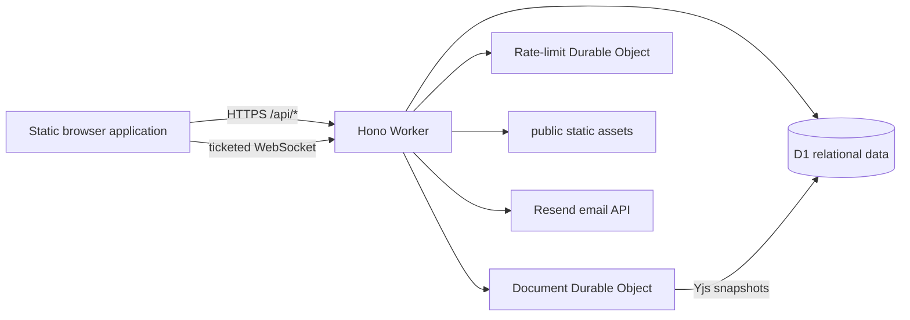

# SyncroEdit Technical Documentation

## System overview

SyncroEdit is a Cloudflare-native collaborative document editor. A static browser application provides authentication, a document library, a Quill-based editor, offline recovery, and profile/settings workflows. A Hono application running in a Cloudflare Worker owns every privileged operation. Cloudflare D1 stores relational application data, while one Durable Object per document coordinates live Yjs collaboration and a second Durable Object class provides durable abuse counters.

This document is the standardized project overview. The deeper [architecture](ARCHITECTURE.md), [project structure](PROJECT_STRUCTURE.md), and [file reference](FILE_REFERENCE.md) documents remain the detailed sources of truth.

## Runtime and repository boundaries

- `src-worker/index.js` is the deployment entry point and exports the Durable Object classes required by Wrangler.
- `src-worker/app.js` constructs the Hono app, middleware pipeline, route dependencies, and common error handling.
- `src-worker/routes/` owns HTTP behavior for authentication, users, documents, and realtime upgrades.
- `src-worker/security.js`, `auth.js`, and `emailVerification.js` centralize validation, authorization, session handling, verification codes, CORS, and response hardening.
- `src-worker/syncObject.js` owns the in-memory Y.Doc, connected sockets, awareness, update authorization, and debounced persistence for one document.
- `src-worker/rateLimitObject.js` owns keyed authentication-abuse counters.
- `public/js/main.js` is the single browser bootstrap. It dispatches by `body[data-page]` and composes modules under `public/js/core`, `app`, and `features`.
- `public/js/features/editor/` owns the collaborative editor and its focused managers; `public/css/` supplies ordered application and page styles.
- `migrations/` is append-only D1 schema history. `tests/` covers Worker, browser-module, security, asset-integrity, and end-to-end contracts.

Static assets are served through the Worker's `ASSETS` binding. API and WebSocket traffic passes through the Worker before reaching storage or a Durable Object; the browser never receives direct D1 or Resend access.

## Core request and collaboration flows

For an HTTP request, global middleware applies security headers and CORS, bounds and parses input, and converts unexpected failures to stable JSON errors. Protected routes resolve a bearer access token or refresh-cookie session, then apply document-level read, edit, or owner guards before issuing prepared D1 statements. Authentication endpoints also use the rate-limit Durable Object. Access JWTs are held in browser memory; refresh JWTs are HttpOnly cookies backed by revocable D1 session rows.

Realtime editing uses a separate short-lived ticket flow:

1. A verified user requests `/api/auth/ws-ticket` with a valid access token.
2. The browser upgrades `/ws/:documentId` using that ticket.
3. The Worker validates ticket type and expiry, user state, and document access.
4. The request is forwarded to the Durable Object named for the document UUID.
5. The object loads the stored Yjs snapshot, synchronizes the client, relays awareness and authorized updates, and persists a debounced snapshot to D1.

Yjs state is the collaborative content source. `document_pages` remains a compatibility representation for the first-page HTTP API, and `document_history` is an audit trail rather than a full version store. Local IndexedDB Yjs snapshots and the service worker improve recovery during transient network loss; they do not replace server authorization or the persisted room snapshot.

## Data, configuration, and security

The D1 model relates users, sessions, documents, document permissions, pages, recent documents, history events, and verification-code rows. Schema evolution must be introduced through a new numbered migration. Deployed Durable Object class names and migration tags are compatibility contracts and must not be renamed casually.

Wrangler bindings include `DB`, `DOCUMENT_SYNC_OBJECT`, `RATE_LIMIT_OBJECT`, and `ASSETS`. Secret values such as `JWT_SECRET`, `RESEND_API_KEY`, and `EMAIL_CODE_PEPPER` belong in Wrangler secrets. Browser-safe variables include application identity/URL values. Raw verification codes are never stored: Web Crypto generates them and only purpose-bound, peppered hashes are persisted with expiry and attempt metadata.

Document permissions are centralized rather than reimplemented in routes. Imported, pasted, or rendered rich HTML must pass through the Quill sanitizer. WebSocket messages are type-checked and read-only participants cannot persist editing updates. The service worker bypasses API, WebSocket, non-GET, and non-HTTP requests so authenticated data is not cached as static content.

## Development, verification, and operations

Install with `npm install`; use `npm run dev` for local Wrangler development. Apply D1 migrations with `npm run db:migrate:local` or `npm run db:migrate:remote`. There is no asset compilation step: Cloudflare serves `public/` directly.

The normal quality gate is `npm run lint`, `npm test`, and `npm run test:e2e`. Deployment uses `npm run deploy`; a Wrangler dry-run should be used to validate bundling, bindings, static assets, and Durable Object exports before a live deployment. Schema migrations must be applied before deploying code that requires them.

## Extension and failure rules

New endpoints belong in the matching route domain, with reusable authorization and validation kept in shared modules. Browser API calls belong in the core API client and should be exposed through the owning feature/controller. Cross-page editor state should be implemented by a focused manager rather than added to the bootstrap. Any shell asset change must update service-worker cache metadata and integrity coverage.

Expected failures use bounded, non-sensitive responses. Missing bindings fail explicitly, invalid or expired WebSocket tickets are rejected, stale editor lifecycle work is prevented from replacing a newer document, and navigation uses cached content only after network failure. Durable Object cleanup and forced persistence paths must await their work so room state is not silently lost.
