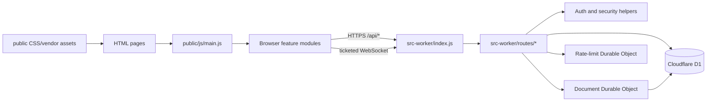
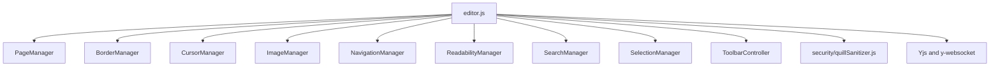
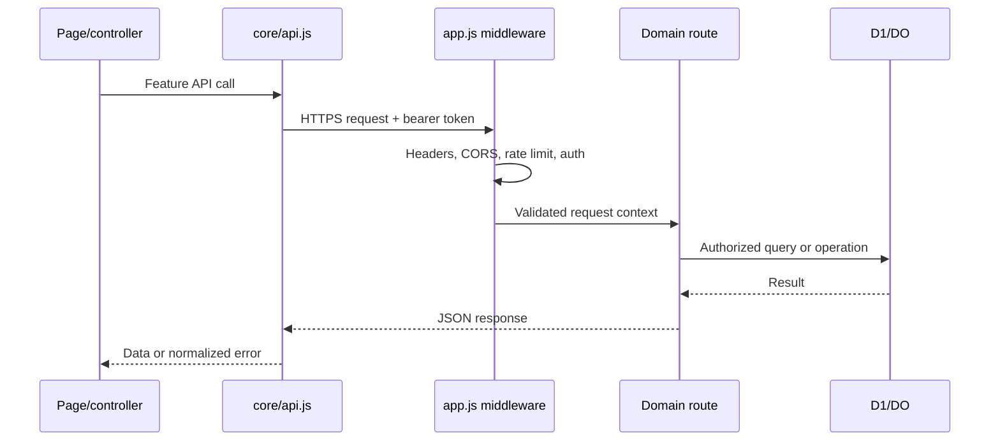
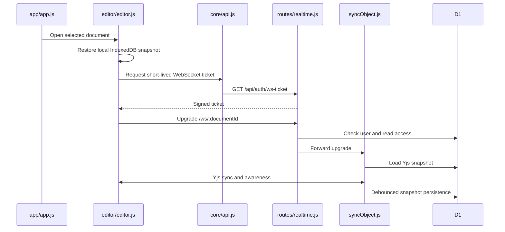
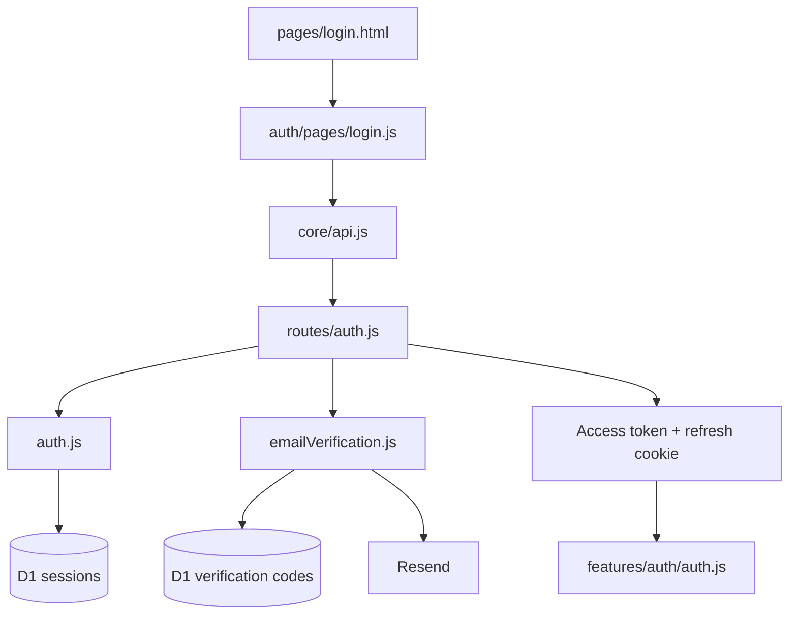

# SyncroEdit Project Structure and File Architecture

This document explains how the SyncroEdit repository is organized, why each subsystem exists, and
how its files work together. It is the navigation guide for maintainers: start here to understand
where a change belongs and follow the links to the deeper contracts.

- [ARCHITECTURE.md](ARCHITECTURE.md) is the runtime and deployment source of truth.
- [FILE_REFERENCE.md](FILE_REFERENCE.md) is the exhaustive retention inventory for every
  first-party file.
- [README.md](../README.md) is the setup and operator entrypoint.
- [SECURITY.md](../SECURITY.md) defines disclosure and dependency-security boundaries.

## 1. System at a Glance



There are four architectural boundaries:

1. `public/` is the browser application and deployable static-asset tree.
2. `src-worker/` is the trusted Cloudflare backend boundary.
3. `migrations/` is append-only database history.
4. `tests/` verifies contracts at unit, integration, DOM, and real-browser levels.

Browser code never receives direct D1, Durable Object, Resend, or secret access. It communicates
through Worker routes. The Worker validates identity and document access before using a binding.

## 2. Annotated Repository Tree

### Root files

```text
SyncroEdit/
├── README.md                 Setup, commands, deployment overview, and documentation index
├── SECURITY.md               Vulnerability reporting and known dependency mitigation
├── docs/
│   ├── DOCUMENTATION.md      Standardized technical overview
│   ├── ARCHITECTURE.md       Runtime boundaries, API contracts, data model, operational rules
│   ├── PROJECT_STRUCTURE.md  Annotated tree and relationships between files and layers
│   └── FILE_REFERENCE.md     Exhaustive purpose and retention inventory
├── package.json              Scripts, dependencies, and Jest configuration
├── package-lock.json         Reproducible dependency graph
├── wrangler.toml             Cloudflare Worker, assets, D1, Durable Objects, and environments
├── .env.example              Secret/binding name documentation without values
└── .gitignore                Local secret, dependency, cache, test, and editor exclusions
```

`package.json` is the command authority. There is no frontend build step: Wrangler deploys
`public/` directly. `wrangler.toml` is the infrastructure authority and points Cloudflare to
`src-worker/index.js`.

### Cloudflare Worker

```text
src-worker/
├── index.js                  Stable deployment and Durable Object export surface
├── app.js                    Hono composition, middleware, dependency wiring, health, config
├── auth.js                   Passwords, JWTs, sessions, authentication, verified-user guards
├── security.js               Validation, limits, CORS, headers, bindings, document authorization
├── emailVerification.js      Verification codes, hashing, expiry policy, Resend delivery
├── syncObject.js             Per-document Yjs WebSocket room and D1 snapshot persistence
├── rateLimitObject.js        Durable authentication-abuse counters
└── routes/
    ├── auth.js               Signup, login, refresh, logout, verification, WebSocket tickets
    ├── user.js               Profile, password, and session management
    ├── documents.js          Document CRUD, settings, recents, transfer, history, metadata
    └── realtime.js           WebSocket ticket/access checks and Durable Object forwarding
```

#### Worker entry and composition

- `src-worker/index.js` must remain small. Cloudflare loads this file, so it only re-exports the
  Hono app and the historical Durable Object class names required by migration history.
- `src-worker/app.js` creates the Hono instance, installs security/error/rate-limit middleware,
  collects shared dependencies, registers domain routes, and exposes `/health` and `/api/config`.
- Files under `src-worker/routes/` register HTTP contracts. They receive dependencies from
  `app.js`; they do not create mutable request-global state.

#### Worker domain helpers

- `src-worker/auth.js` owns identity: password hashing/verification, access and refresh tokens,
  D1-backed sessions, bearer authentication, and verified-account guards.
- `src-worker/security.js` owns trust boundaries: bounded JSON parsing, value validation, response
  headers, CORS, binding requirements, consistent errors, and document permission checks.
- `src-worker/emailVerification.js` owns one-time code generation, purpose-bound hashes, expiry
  policy, pepper requirements, and outbound verification email.
- `src-worker/syncObject.js` owns collaborative room state. Each document ID maps to one Durable
  Object that holds a Y.Doc, sockets, awareness, and debounced D1 persistence.
- `src-worker/rateLimitObject.js` owns durable abuse counters so limits are not process-local.

### Browser pages and platform files

```text
public/
├── index.html                       Editor/library shell, import map, toolbar, dialogs, boot guard
├── config.js                        Browser-safe same-origin runtime defaults
├── sw.js                            Versioned application-shell and offline cache policy
├── logo.svg                         Favicon and application logo
├── _headers                         Static-asset CSP and browser security headers
├── .well-known/security.txt         Canonical security contact
├── security.txt                     Compatibility security contact
└── pages/
    ├── login.html                   Login, signup, and signup-verification panels
    ├── forgot-password.html         Password-recovery email form
    ├── reset-password.html          Reset token, new password, and optional MFA form
    └── verify.html                  Standalone verification-code form
```

Every HTML page declares `body[data-page]` and loads `/js/main.js`. Static HTML owns structure and
accessible labels; JavaScript owns behavior. The editor shell keeps only critical pre-CSS boot
rules inline to prevent protected UI flashing before session state is known.

`public/_headers` is implicitly consumed by Cloudflare static assets even though no JavaScript
imports it. The two `security.txt` files intentionally contain the same contact: the well-known
path is canonical and the root copy supports compatibility probes.

### Browser JavaScript entry and core

```text
public/js/
├── main.js                           Page detection and lazy initializer dispatch
├── core/
│   ├── api.js                        Low-level HTTP, refresh retry, and endpoint helpers
│   ├── config.js                     Runtime config and API/WebSocket URL construction
│   ├── validation.js                 Shared email/password validation
│   ├── errors.js                     Stable user-facing API/configuration messages
│   └── debounce.js                   Shared trailing debounce primitive
└── app/
    ├── bootstrap.js                  Authenticated editor-page bootstrap
    ├── app.js                        Top-level feature composition and view/document lifecycle
    ├── network.js                    Feature-facing compatibility API façade
    ├── utils.js                      Escaping, navigation, storage, conversion, shared re-exports
    └── Plugin.js                     Lifecycle base class for editor/UI plugins
```

The browser boot chain is:

```mermaid
flowchart LR
  HTML[HTML body data-page] --> Main[main.js]
  Main -->|editor| Bootstrap[app/bootstrap.js]
  Bootstrap --> App[app/app.js]
  Main -->|auth page| PageController[features/auth/pages/*]
  App --> Network[app/network.js]
  Network --> API[core/api.js]
  API --> Worker[/api routes]
```

`public/js/core/api.js` is the transport layer. `public/js/app/network.js` is the existing
feature-oriented façade. New code should not duplicate fetch/refresh logic in page controllers.

### Authentication feature

```text
public/js/features/auth/
├── auth.js                            Access-token state, refresh, logout, current user
├── pages/
│   ├── login.js                       Login/signup forms and inline signup verification
│   ├── forgotPassword.js              Forgot-password page behavior
│   ├── resetPassword.js               Reset-password validation and submission
│   └── verify.js                      Standalone verification and resend behavior
└── syncro/
    └── SyncroBot.js                  Mascot state, gaze, focus priority, and bounded reactions
```

`auth.js` owns session state and is shared by the editor and auth pages. Page files own only their
DOM and flow. `SyncroBot.js` owns semantic visual state, pointer gaze, and bounded reactions. It
relies on `public/css/syncro.css` for presentation.

### Editor and feature modules

```text
public/js/features/
├── editor/
│   ├── editor.js                      Quill/Yjs/WebSocket/IndexedDB coordinator
│   └── managers/
│       ├── PageManager.js             Pages, sizes, ordering, virtualization, Yjs metadata
│       ├── BorderManager.js           Page border state and controls
│       ├── CursorManager.js           Remote collaborator cursors and selections
│       ├── ImageManager.js            Image insertion, selection, and resizing
│       ├── NavigationManager.js       Active-page navigation controls
│       ├── ReadabilityManager.js      Readability calculations and presentation
│       ├── SearchManager.js           Find/replace, highlighting, and navigation
│       └── SelectionManager.js        Selection capture, restoration, and format targets
├── library/LibraryManager.js          Document list, filters, creation, opening, deletion
├── profile/profile.js                 Profile, avatar, verification, password, sessions
├── theme/
│   ├── theme.js                       Persisted light/dark and accent state
│   └── background.js                  Dynamic background rendering and theme reaction
└── ui/
    ├── ui.js                          Small escaped UI renderers and notices
    ├── UIManager.js                   Global controls, modals, view state, open status
    └── ToolbarController.js           Toolbar-to-Quill formatting bridge
```

`public/js/features/editor/editor.js` is the editor coordinator, not the owner of every editor
behavior. Long-lived behavior with state/listeners belongs in a manager. Managers that integrate
with editor lifecycle extend `public/js/app/Plugin.js`.



### Browser security and vendored adapter

```text
public/js/
├── security/quillSanitizer.js          HTML/URL sanitization and safe HTML-to-Delta conversion
└── vendor/y-websocket.js               Checked-in browser bundle selected by the import map
```

Quill HTML is untrusted at paste, import, export, and render boundaries. The sanitizer removes
dangerous tags, handlers, protocols, and unsupported embeds before Quill consumes markup.

`public/js/vendor/y-websocket.js` is upstream-derived bundled code. It is excluded from lint and
format churn and should be replaced as a unit when its upstream package is updated.

### Stylesheets and cascade ownership

```text
public/css/
├── app/
│   ├── core.css                        Variables, foundations, controls, shared components, fonts
│   ├── editor.css                      Document canvas, pages, toolbar, responsive editor
│   ├── effects.css                     Themes, loaders, skeletons, notices, animations
│   └── settings.css                    Profile, settings, sharing, history, modal presentation
├── pages/
│   ├── login.css                       Login/signup and verification presentation
│   ├── forgot-password.css             Forgot-password-only presentation
│   ├── reset-password.css              Reset-password/MFA presentation
│   └── verify.css                      Standalone verification presentation
└── syncro.css                         Shared mascot rig, states, particles, and animations
```

The application CSS files load in the displayed order. Their separation describes ownership but
does not create CSS isolation, so moving a rule between files can change the cascade. Page CSS may
depend on variables or primitives established by shared application/auth styles.

### Directly served vendor assets

```text
public/vendor/
├── dompurify/                           HTML sanitization ES module
├── fontawesome/                         Icon CSS, licence, regular and solid WOFF2 fonts
├── fonts/google/                        Editor font catalogue and WOFF2 subsets
├── highlight.js/                        Quill code-block highlighting and theme
├── idb-keyval/                          IndexedDB helper used for local recovery
├── quill/                               Editor runtime, Snow stylesheet, licence
├── yjs/                                 Yjs browser wrapper, bundle, process shim
└── y-quill/                             Quill/Yjs binding wrapper and bundle
```

These packages are copied into `public/` because the browser code is served without a bundling
step. `public/index.html` uses an import map for Yjs, y-websocket, y-quill, and DOMPurify. The
service worker caches the wrappers and runtime shell. Font binaries are retained because they are
referenced by CSS and exposed in the editor font picker.

### Database migrations

```text
migrations/
├── 0001_schema.sql                       Core users, sessions, documents, pages, access, history
├── 0002_email_verification_codes.sql     Canonical verification timestamp and code storage
└── 0003_backfill_email_verification_mirror.sql
                                          Legacy verification mirror synchronization
```

Migrations are ordered history, not a replaceable snapshot. Add a new numbered migration for every
schema/data transition. Do not edit or delete an applied migration to make the folder look cleaner.

### Configuration and repository automation

```text
config/
├── .babelrc                              Jest transformation for browser modules
├── .prettierrc                           Formatting rules
├── .prettierignore                       Generated/vendor formatting exclusions
├── eslint.config.cjs                     Lint targets, globals, exclusions, and rules
└── playwright.config.js                  Browser projects and local Wrangler+D1 server

.github/
├── copilot-instructions.md               Repository-aware Copilot guidance
└── dependabot.yml                        npm and GitHub Actions dependency checks
```

Configuration files are invoked by `package.json` scripts or their corresponding tools. They are
not browser assets and must not be added to the service-worker cache.

### Tests

```text
tests/
├── env.js                                Environment installed before Jest modules
├── setup.js                              Shared Jest/DOM setup
├── mockD1.js                             Stateful D1 test double
├── mocks/emptyModule.js                  Browser-only package replacement for Jest
├── unit/
│   ├── emailVerification.test.js         Verification-code generation
│   └── worker.test.js                    Worker routes, auth, access, sessions, Durable Objects
├── integration/security.test.js          Headers, CORS, malformed input, error boundaries
├── frontend/
│   ├── app/
│   │   ├── app.test.js                   App composition, gates, navigation, document lifecycle
│   │   ├── assets.test.js                Assets, retired paths, precache, documentation inventory
│   │   ├── document-open.test.js         Open ordering, stale requests, failure protection
│   │   ├── network.test.js               API façade and errors
│   │   ├── sw.test.js                    Service-worker lifecycle and strategies
│   │   └── verification.test.js          Unverified dashboard/profile behavior
│   └── features/
│       ├── auth/auth.test.js              Verification-state normalization
│       ├── auth/authController.test.js    Auth DOM safety and form behavior
│       ├── editor/editor.test.js          Editor lifecycle, resilience, sanitized content
│       ├── editor/quillSanitizer.test.js  Unsafe HTML/URL removal
│       ├── editor/virtualization.test.js  Bounded large-document DOM work
│       ├── editor/managers/*.test.js      Page, border, cursor, search, selection contracts
│       ├── profile/profile.test.js        Profile, verification, updates, safe rendering
│       └── theme/background.test.js       Dynamic-background lifecycle
└── e2e/
    ├── helpers/auth.js                    Browser/API account and verification helpers
    ├── auth-flow.test.js                  Registration-to-editing workflow and reload
    ├── auth-ui.test.js                    Auth UI, mascot, validation, verification, layout
    ├── interactions.test.js               Toolbar formatting and theme switching
    └── responsiveness.test.js             Desktop/mobile login and editor layout
```

Unit tests validate isolated contracts. Integration tests exercise the assembled Worker boundary.
Frontend Jest tests use DOM mocks for browser modules. Playwright tests run the actual Worker,
local D1 migrations, static assets, and desktop/mobile Chromium projects.

## 3. Runtime Dependency Flows

### HTTP request flow



Session refresh is centralized in `public/js/core/api.js`. Route authentication is centralized in
`src-worker/auth.js`; document authorization is centralized in `src-worker/security.js`.

### Editor and realtime flow



Yjs content is canonical for collaboration. `document_pages` remains a compatibility/API surface;
it is not a second realtime authority. Local IndexedDB state improves recovery but does not bypass
server permission checks.

### Authentication and verification flow



The browser keeps the access token in memory. The refresh token is an HttpOnly cookie backed by a
D1 session row. Verification codes are stored as peppered hashes, not plaintext.

## 4. State Ownership

| State                               | Authoritative owner                                      | Consumers                                      |
| ----------------------------------- | -------------------------------------------------------- | ---------------------------------------------- |
| Access token/current user           | `public/js/features/auth/auth.js`                        | App bootstrap, profile, library, API hooks.    |
| Refresh session                     | D1 `sessions` plus HttpOnly cookie                       | Worker authentication and refresh routes.      |
| Current application view/open token | `public/js/app/app.js`                                   | UI manager, library, editor lifecycle.         |
| Collaborative document content      | Y.Doc in `src-worker/syncObject.js`, persisted to D1     | Browser Yjs provider and Quill binding.        |
| Visible editor pages                | `public/js/features/editor/managers/PageManager.js`      | Editor, navigation, selection, virtualization. |
| Remote awareness/cursors            | Document Durable Object and `CursorManager.js`           | Collaborator UI.                               |
| Theme/accent preference             | `public/js/features/theme/theme.js` plus browser storage | App shell and dynamic background.              |
| Profile and session presentation    | `public/js/features/profile/profile.js`                  | Profile/settings dialogs.                      |
| Offline shell cache                 | `public/sw.js`                                           | Navigation and static GET requests.            |
| Database schema                     | Ordered files under `migrations/`                        | D1 environments and Worker queries.            |

State should not be duplicated into a new global owner. Extend the established owner and expose a
narrow method or event to consumers.

## 5. Where Changes Belong

| Change                              | Primary location                                       | Required companion work                                                               |
| ----------------------------------- | ------------------------------------------------------ | ------------------------------------------------------------------------------------- |
| Add an API endpoint                 | Matching `src-worker/routes/*.js` domain               | Validation/auth helper, Worker tests, API client method, architecture endpoint table. |
| Change authentication/session rules | `src-worker/auth.js` and auth routes                   | Security tests, frontend auth normalization, migration if persistence changes.        |
| Change document permission rules    | `src-worker/security.js`                               | Every affected HTTP/WebSocket route and authorization tests.                          |
| Add a D1 field/table                | New numbered migration                                 | Worker queries, mock D1 behavior, tests, data-model docs.                             |
| Add an auth page                    | HTML in `public/pages/`, page CSS, page initializer    | `main.js`, service-worker cache version/list, E2E coverage.                           |
| Add editor behavior                 | Existing/new manager under `features/editor/managers/` | Editor composition, focused manager tests, toolbar/UI wiring if visible.              |
| Add a transport call                | `public/js/core/api.js`                                | Expose through the appropriate façade/controller and test errors/refresh.             |
| Add shared styling                  | Correct ordered `public/css/app/` layer                | Verify dark/light and responsive states.                                              |
| Add page-only styling               | Matching `public/css/pages/` file                      | Keep selectors scoped to that page.                                                   |
| Change static shell assets          | `public/` plus `public/sw.js`                          | Bump cache name and update asset-integrity tests.                                     |
| Update a vendored browser package   | Replace its package directory as a unit                | Preserve licence, import-map URLs, CSS references, and browser tests.                 |

## 6. Retention and Cleanup Rules

A file is safe to remove only after all applicable checks agree:

1. It is not a Worker, browser, test, migration, package, or platform entrypoint.
2. It has no static or dynamic import, HTML/CSS reference, import-map alias, script command, Wrangler
   configuration reference, or implicit platform role.
3. Its behavior is not part of a tested or externally reachable contract.
4. Its licence is not required by a retained vendored package.
5. Asset and browser tests still pass after removal.

Generated `.wrangler/`, `test-results/`, `playwright-report/`, coverage output, and empty directories
are disposable. `.dev.vars` and personal agent/tool settings are local but not disposable because
they may contain secrets or user-specific configuration.

## 7. Validation Contract

Run these checks after architectural or file-structure changes:

```bash
npm run lint
npm test
npm run test:e2e
npx wrangler deploy --dry-run --outdir /tmp/syncroedit-dry-run --env=""
git diff --check
```

`tests/frontend/app/assets.test.js` verifies that local HTML/CSS references resolve, every
service-worker precache target exists, retired paths stay removed, and every retained first-party
file appears in `FILE_REFERENCE.md`.
